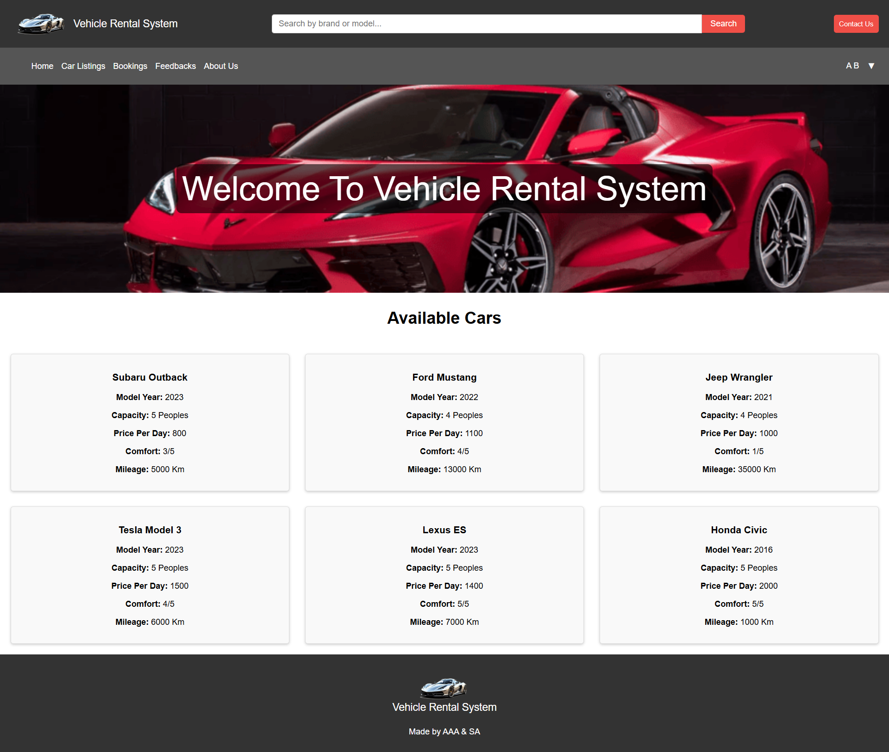
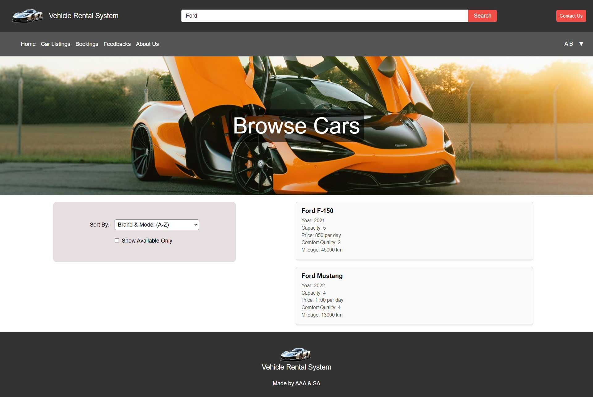
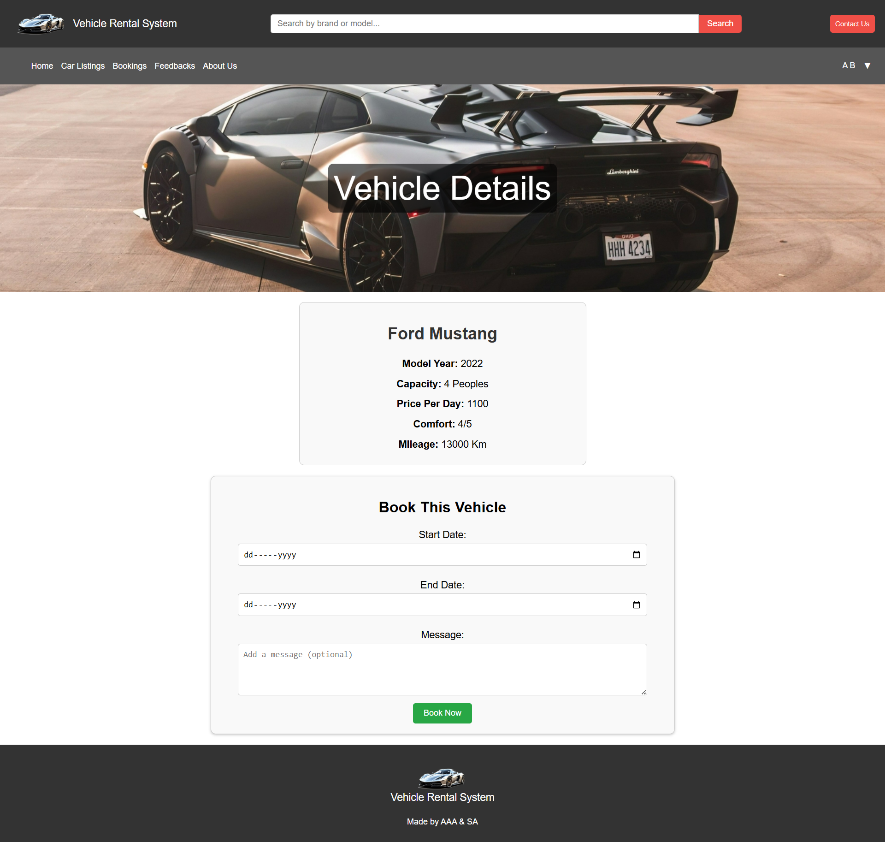
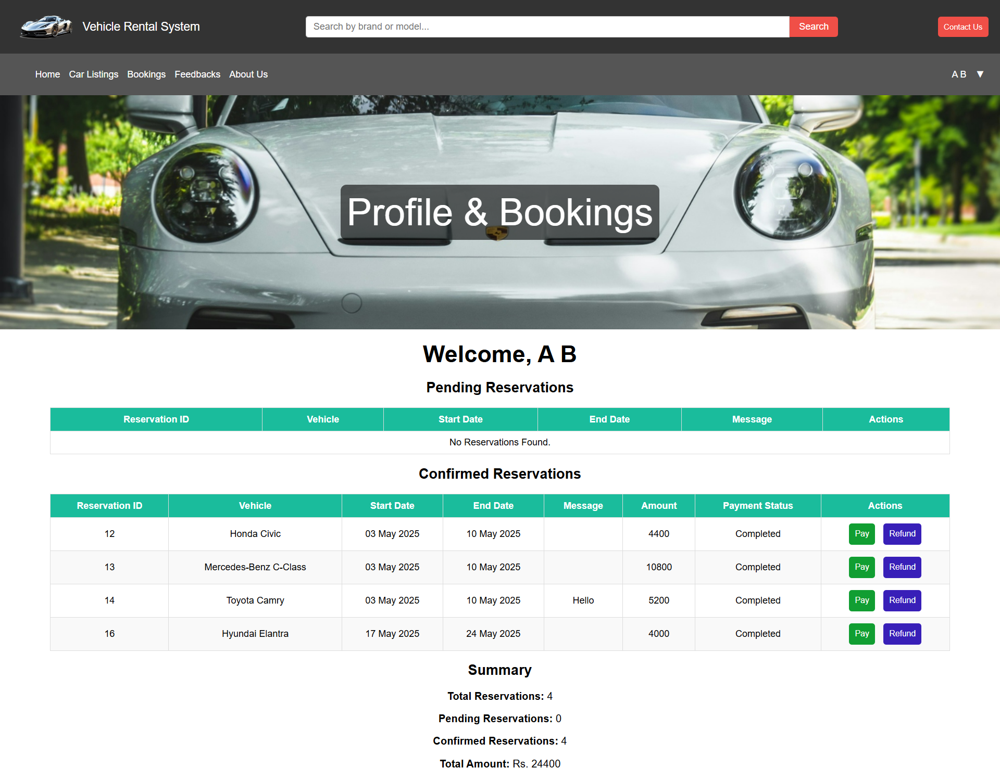
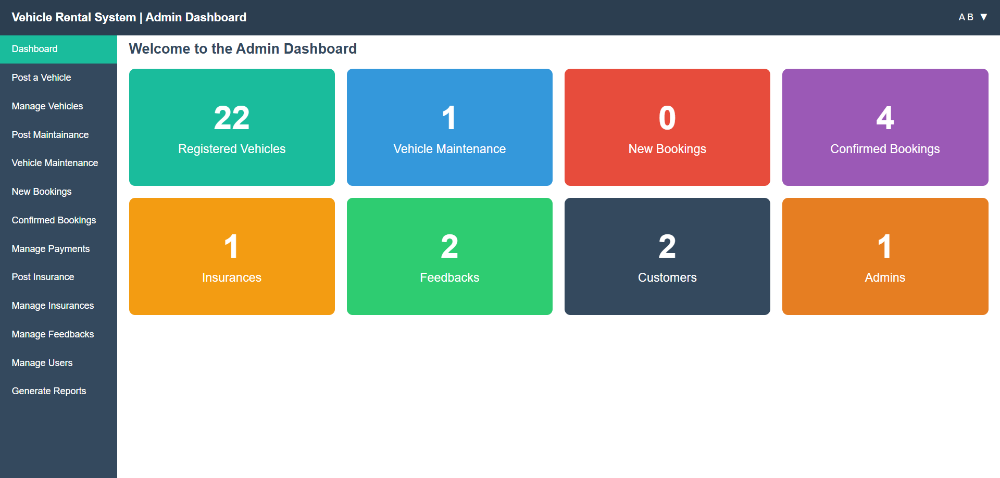
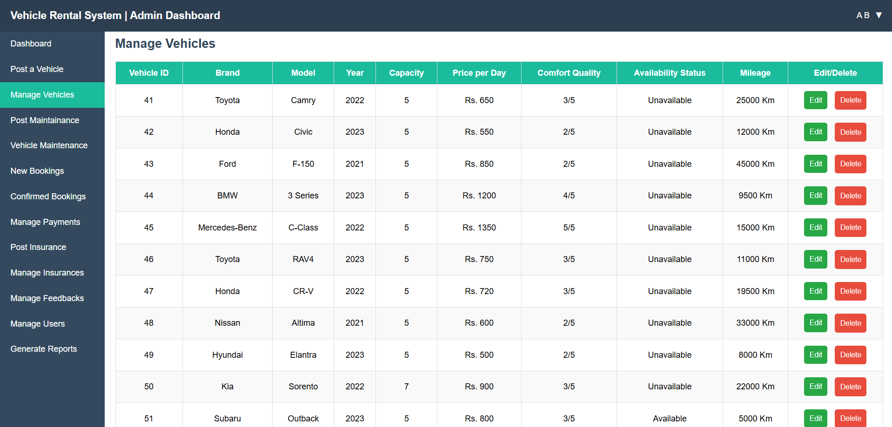
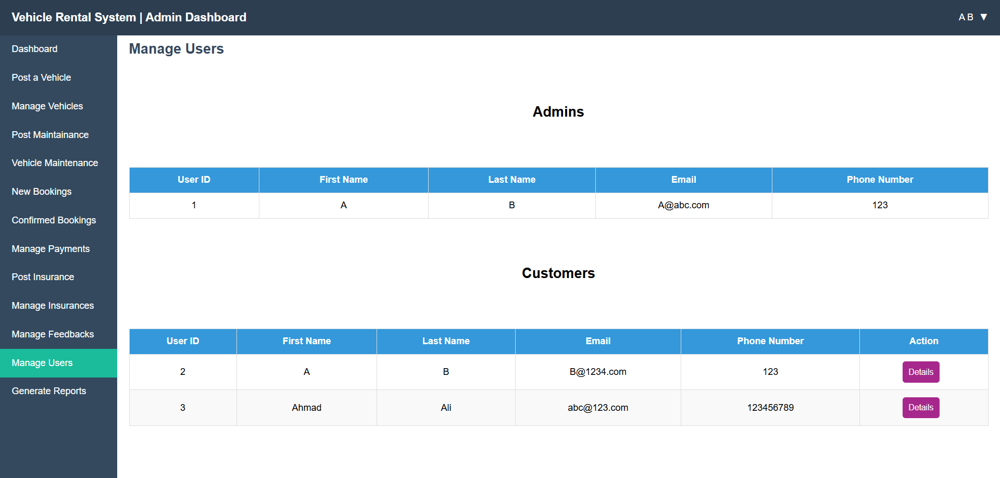

# Vehicle Rental Service

A multi-dashboard vehicle rental service application featuring user and admin interfaces, developed as part of the academic coursework for the following courses:

* **Database Systems**
* **Software Design and Analysis**
* **Software Engineering**

## 📚 Overview

This project provides a comprehensive solution for vehicle rentals, encompassing functionalities such as user registration, vehicle browsing, booking management, and administrative controls. The system is designed with separate dashboards for users and administrators to streamline operations and enhance user experience.

## 🚀 Features

* **User Module:**

  * User registration and authentication
  * Dashboard displaying available vehicles
  * Search and filter vehicles
  * Booking vehicles
  * Viewing and managing personal bookings

* **Admin Module:**

  * Administrator authentication
  * Dashboard with system analytics
  * Vehicle management (add, update, delete)
  * User management
  * Booking oversight

## 🖼️ UI Screenshots

### 1. User Dashboard

Below are some screenshots illustrating the various parts of the Vehicle Rental Service application.



### 2. All Cars Listing with Search



### 3. Booking Page



### 4. All Bookings Page



### 5. Admin Dashboard



### 6. Vehicle Management



### 7. User Management



## 🛠️ Technologies Used

* **Frontend:**

  * HTML, CSS, JavaScript

* **Backend:**

  * Node.js with Express.js framework
  * MySQL for database management

* **Tools & Libraries:**

  * bcrypt for password hashing

## 📂 Project Structure

```
VehicleRentalService/
├── AdminDashboard/
├── LoginSignup/
├── Server/
├── UserDashboard/
├── screenshots/
├── tempprojectvrs.sql
├── README.md
└── LICENSE
```

## 🚀 Setup and Installation

### Prerequisites

* **Node.js** (v14 or later): [Download Node.js](https://nodejs.org/)
* **MySQL** (v5.7 or later): [Download MySQL](https://dev.mysql.com/downloads/)
* **Git**: [Download Git](https://git-scm.com/downloads)

### Clone the Repository

```bash
git clone https://github.com/ahmadaliansarii/VehicleRentalService.git
cd VehicleRentalService
```

### Backend Setup

1. Navigate to the `Server` directory:

   ```bash
   cd Server
   ```

2. Install dependencies:

   ```bash
   npm install
   ```

3. Configure the database:

   * Create a MySQL database named `vehicle_rental_service`.
   * Import the `tempprojectvrs.sql` file located in the root directory to set up the necessary tables and data.

4. Start the backend server:

   ```bash
   npm start
   ```

   The server will run at `http://localhost:3000`.

### Frontend Setup

The frontend comprises three parts: **User Dashboard**, **Admin Dashboard**, and **Login/Signup**.

#### Login/Signup

1. Open another terminal window.

2. Navigate to the `LoginSignup` directory:

   ```bash
   cd ../LoginSignup
   ```

3. Serve the `login.html` file using `live-server`:

   ```bash
   live-server login.html
   ```

   This will open the login/signup page in your default browser.

---

## 📖 Usage

1. **User Access:**

   * Open the Login Page in your browser (e.g., `http://127.0.0.1:5050`).
   * Register a new account or log in with existing credentials.
   * Browse available vehicles, make bookings, and manage your rentals.

2. **Admin Access:**

   * Open the Login Page in your browser (e.g., `http://127.0.0.1:5050`).
   * Log in with admin credentials.
   * Manage vehicles, users, and oversee bookings.

**Note:** Ensure that the backend server is running before accessing the dashboards to enable full functionality.

## 📄 License

This project is licensed under the [MIT License](LICENSE).
